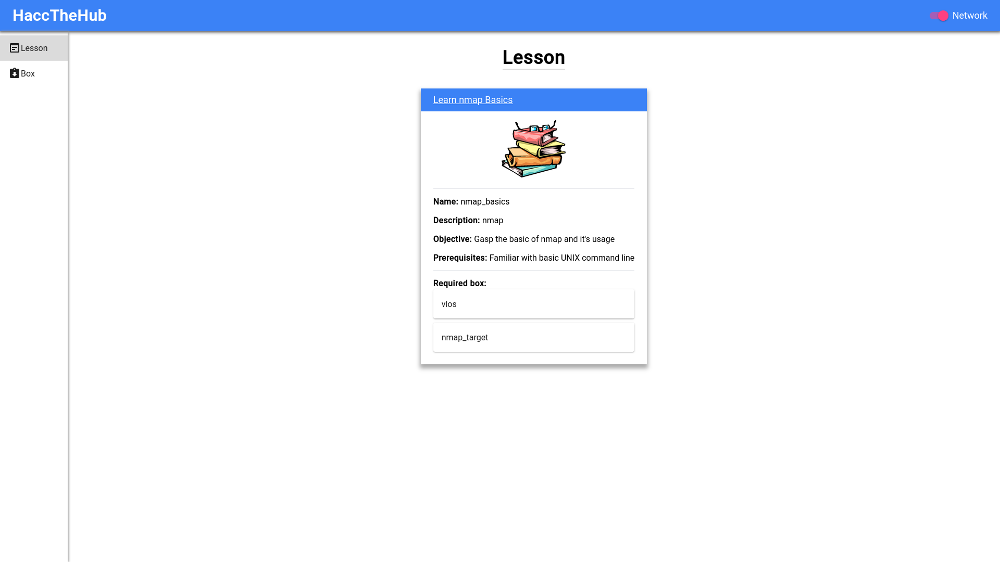

# CyberHub
<div align="center">

</div>

Plateforme d'apprentissage open source auto-hébergée en matière de cybersécurité

## À propos du projet


CyberHub est un projet open source qui fournit la cybersécurité

CyberHub système se compose de 3 parties principales:
* Docker: contenant toutes les boîtes créant l'environnement dans lequel nous allons apprendre.
* Le backend: contrôlant Docker et responsable du démarrage/de la destruction des boîtes individuelles dans le système et de la gestion de la mise en réseau qui les relie dans un système unifié.
* Le front-end: Interface graphique permettant à l'utilisateur d'interagir avec le système via son navigateur Web.
### Construit avec
* [Flask-RESTX](https://github.com/python-restx/flask-restx)
* [Next.js](https://nextjs.org/)

## Commencer

Pour que CyberHub soit opérationnel, vous devez configurer les éléments suivants

### Prérequis

* Docker (consultez la [documentation de Docker](https://docs.docker.com/get-docker/) pour la configuration)
* Python 3 ([Télécharger](https://www.python.org/downloads/)) ou installez simplement `python3` à partir de votre gestionnaire de packages.
* Node.js 16 ([Télécharger](https://nodejs.org/en/download/)) ou utilisez votre [gestionnaire de packages](https://nodejs.org/en/download/package-manager/)


### Installation
1. Cloner le repo
```sh
git clone https://github.com/CyberHackFR/CyberHub.git
```
2. Installer les dépendances pour le backend
```sh
cd CyberHub/backend
python3 -m pip install -r requirements.txt
```
3. Et les dépendances pour le frontend
```sh
cd ../client
npm install
```

## Usage
1. Démarrer Docker
2. Démarrer le backend
```sh
cd ../backend
python3 main.py
```
3. Et le front-end
```
cd ../client
npm start
```

Le WebUI devrait maintenant être accessible via http://localhost:8080.

## Contributing

## License
Distribué sous la licence publique générale GNU Affero v3.0. Voir `LICENCE` pour plus d'informations.

## Authors

## Contributors


## Acknowledgement
